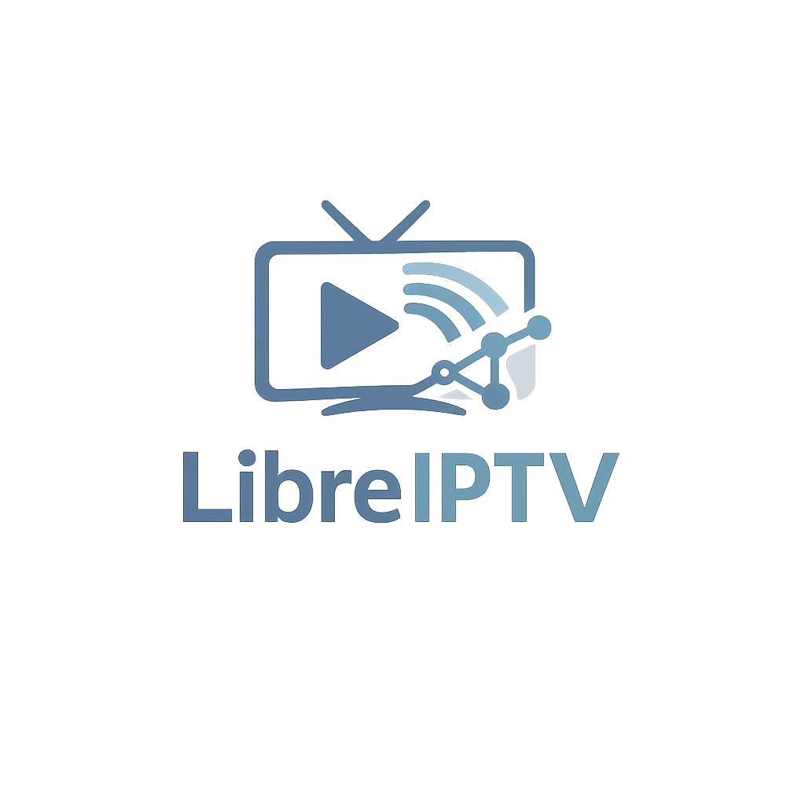
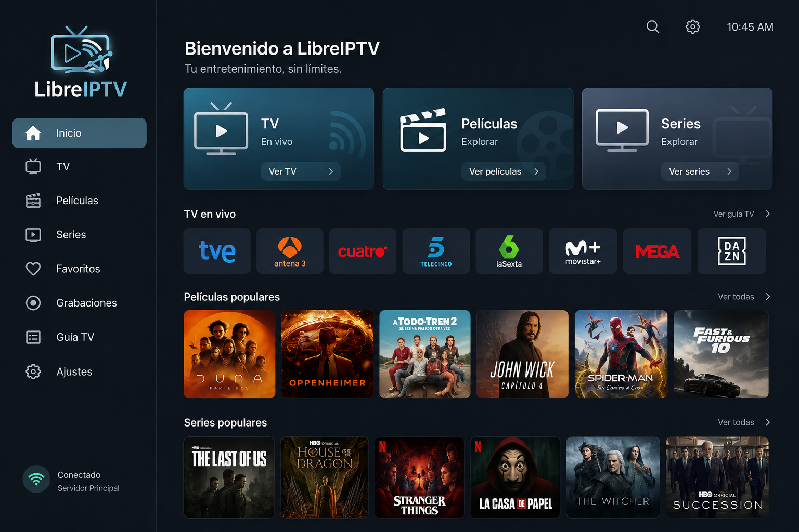

<div align="center">
  

  # LibreIPTV

  **Tu contenido IPTV en Android TV y móvil, sin complicaciones.**

  
  
  
</div>

---

## ¿Qué es LibreIPTV?

LibreIPTV es una aplicación nativa para **Android TV y Android móvil** que te permite
reproducir tu propio contenido IPTV. Conecta tu servidor Xtream Codes o pega una URL
de lista M3U y accede a canales de TV en vivo, películas y series con portadas y
sinopsis en español obtenidas automáticamente de TMDB.

<div align="center">
  
</div>

---

## ⬇️ Descargar

> Los APK están en la sección **Releases** de este repositorio.

| Dispositivo | Archivo | Descarga |
|---|---|---|
| **Android móvil** (teléfono / tablet) | `LibreIPTV-1.6.1.apk` | [⬇️ Descargar última versión](https://github.com/Medina07P/LibreIPTV_Download/releases/latest) |
| **Android TV / Google TV / Fire TV** | `LibreIPTV-1.6.1.apk` | [⬇️ Descargar última versión](https://github.com/Medina07P/LibreIPTV_Download/releases/latest) |

> **Nota:** el APK es universal y funciona tanto en móvil como en Android TV.
> Si en el futuro se publican variantes separadas, aparecerán nombradas de forma distinta.

---

## 📱 Instalación en Android móvil

1. **Descarga el APK** usando el enlace de arriba.
2. Abre el APK desde la app de **Archivos** (o desde la notificación de descarga).
3. Si es la primera vez, Android te pedirá permiso para **instalar apps de fuentes desconocidas**:
   - Toca **Configuración** en el aviso.
   - Activa la opción **Permitir desde esta fuente**.
   - Vuelve atrás y toca **Instalar**.
4. Una vez instalada, abre **LibreIPTV** desde el cajón de apps.

---

## 📺 Instalación en Android TV / Google TV / Fire TV

### Opción A — Con la app Downloader (recomendado)
1. Instala **Downloader** (de AFTVnews) desde Google Play o la tienda de tu dispositivo.
2. En los **Ajustes del sistema** → *Seguridad y restricciones* (o *Apps desconocidas*),
   activa **Permitir orígenes desconocidos** para la app Downloader.
3. Abre Downloader e introduce la URL directa del APK
   (encuéntrala en la sección [Releases → Assets](https://github.com/Medina07P/LibreIPTV_Download/releases/latest)).
4. Descarga e instala. Abre LibreIPTV desde la pantalla de inicio del TV.

### Opción B — Con ADB (usuarios avanzados)
```bash
adb connect <ip-del-tv>
adb install LibreIPTV-1.6.1.apk
```

---

## ✨ Características

- 📡 **TV en vivo, Películas y Series** organizadas automáticamente.
- 🔐 **Registro y login** con correo y contraseña — acceso inmediato.
- 🌐 **Orígenes IPTV flexibles**: servidor Xtream Codes o URL de lista M3U.
- 🎬 **Metadatos TMDB** en español: pósters, sinopsis, género y reparto.
- ⭐ **Favoritos** por categoría (canales, películas, series).
- ▶️ **Continuar viendo**: retoma donde lo dejaste.
- 📺 **Optimizada para mando a distancia** (D-pad) con interfaz sidebar en TV.
- 📱 **Diseño adaptado** a móvil con `WindowSizeClass`.
- 🔊 Soporte de audio **AC3 / E-AC3 / DTS** por software (decoder FFmpeg).
- 🔄 **Actualización in-app**: avisa automáticamente cuando hay una versión nueva.
- 👤 **Sesión única por dispositivo** para evitar conexiones simultáneas no deseadas.

---

## 📋 Requisitos

| Requisito | Detalle |
|---|---|
| **Android** | 6.0 o superior (API 23+) |
| **Android TV** | Cualquier versión (Android TV / Google TV / Fire TV) |
| **Internet** | Conexión estable recomendada (mejor Wi-Fi o Ethernet) |
| **Cuenta** | Correo electrónico para registro en la app |
| **Origen IPTV** | Servidor Xtream Codes **o** URL de lista M3U propios |

---

## 🚀 Primer uso

1. **Abre la app** → toca *Crear cuenta* e introduce tu correo y contraseña.
2. Elige el **tipo de origen IPTV**:
   - *Xtream Codes*: introduce la URL del servidor, usuario y contraseña.
   - *Lista M3U*: pega la URL directa de tu lista `.m3u` o `.m3u8`.
3. La app cargará y clasificará el contenido automáticamente.
4. ¡Disfruta de tu contenido en **TV en vivo**, **Películas** y **Series**!

---

## 📝 Notas de versión

Consulta el historial completo de cambios en la pestaña
[**Releases**](https://github.com/Medina07P/LibreIPTV_Download/releases).

---

## ⚖️ Aviso legal

> **LibreIPTV no proporciona, almacena ni distribuye ningún contenido multimedia.**
> La aplicación es únicamente un reproductor que utiliza los orígenes IPTV
> (listas M3U o servidores Xtream Codes) que el propio usuario configura.
> El usuario es el único responsable de asegurarse de que el contenido que
> reproduce está licenciado o es de dominio público en su jurisdicción.
> El uso de esta aplicación para acceder a contenido protegido sin autorización
> puede infringir las leyes de propiedad intelectual de tu país.
